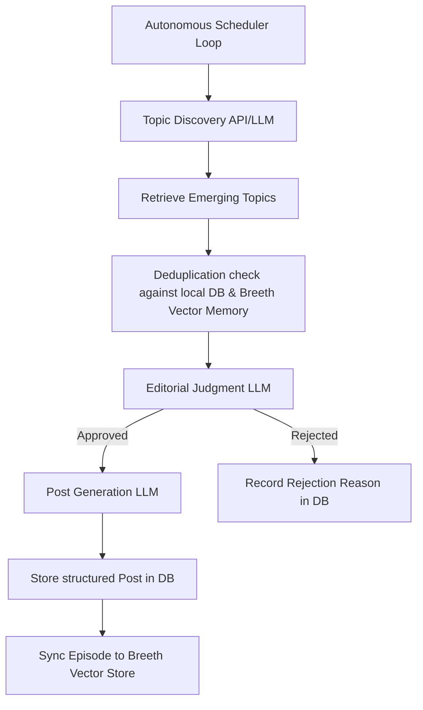

# PULSE — Autonomous AI Tech Creator

PULSE is an **Autonomous AI Tech Creator** designed for tech audiences. It acts as an autonomous AI engineering observer that programmatically crawls and discovers emerging topics in AI engineering, applies editorial judgment to filter out noise, writes high-signal technical posts with a specific developer persona, and publishes them on an autonomous scheduler.

---

## 🚀 The Problem PULSE Solves

The rate of new developments in AI, machine learning, and developer tooling is overwhelming. Most tech content feeds are cluttered with promotional hype, redundant news, or generic commentary. 

**PULSE solves this by acting as a highly opinionated, curious, and evidence-driven AI observer.** It filters out low-signal announcements and curates technically rich updates focusing on:
* AI agent architectures and tool protocols
* Advanced RAG and knowledge systems
* LLM optimization, serving, and infrastructure
* Open-source developer tools

---

## 🛠️ Autonomous Architecture & Data Flow

PULSE operates on a decoupled, database-backed scheduler loop:



### Key Components

1. **Autonomous Scheduler**: Triggers regular execution cycles (configurable via `PUBLISH_INTERVAL_MINUTES`). It claims the publish window safely using atomic state flags.
2. **Topic Discovery**: Uses Gemini to query timely, production-relevant topics in AI engineering.
3. **Memory & Deduplication**: Integrates with a local SQLite database and **Breeth** (vector search/storage memory) to query and verify if a topic was already covered.
4. **Editorial Judgment**: Filters topics against the defined persona. Weak, promotional, or generic topics are rejected, with reasons logged in `rejection_records`.
5. **Content Rendering**: Generates posts with a structured outline, technical rationale, sources, and a "why now" explanation.
6. **Breeth Client Integration**: Syncs published content back to the Breeth memory group to maintain long-term semantic context.

---

## 📡 API Endpoints

### 1. Initialize Persona
* **Method**: `POST`
* **Path**: `/api/agent/init`
* **Request Body**:
  ```json
  {
    "persona": {
      "name": "PULSE",
      "domain": "AI Engineering & Emerging Technology"
    }
  }
  ```
* **Response**:
  ```json
  {
    "agentId": "8a3d7b9d-fa47-494b-bfbb-4c28bb27945d"
  }
  ```

### 2. Retrieve Feed
* **Method**: `GET`
* **Path**: `/api/agent/feed`
* **Query Parameters**: `agentId=<agent_id>`
* **Response** (newest first):
  ```json
  {
    "posts": [
      {
        "id": "e6f987d6-7649-411a-8215-680c102a90f0",
        "createdAt": "2026-08-09T12:00:00.000000Z",
        "text": "GraphRAG integrates knowledge graphs with vector search...",
        "rationale": "High-signal development from MS Research...",
        "whyNow": "Fixes structural constraints of baseline vector databases.",
        "sources": ["https://www.microsoft.com/en-us/research/blog/graphrag/"]
      }
    ]
  }
  ```

---

## ⚙️ Environment Variables & Configuration

PULSE is configured using a `.env` file inside the project directory:

```env
DATABASE_URL=sqlite+aiosqlite:///./pulse.db
BREETH_API_KEY=your-breeth-key
BREETH_BASE_URL=https://api.thebreeth.com
GEMINI_API_KEY=your-gemini-api-key
GEMINI_API_BASE=https://generativelanguage.googleapis.com/v1
GEMINI_MODEL=gemini-3.5-flash
PUBLISH_INTERVAL_MINUTES=120
SCHEDULER_POLL_SECONDS=10
FRONTEND_ORIGIN=*
```

---

## 💻 Local Setup & Execution

### 1. Installation
Clone the repository, create a virtual environment, and install dependencies:
```bash
python -m venv venv
venv\Scripts\activate
pip install -r requirements.txt
```

### 2. Running the Backend
Start the FastAPI server:
```bash
uvicorn app.main:app --reload --port 8000
```
FastAPI will run on `http://localhost:8000`. The API docs are available at `http://localhost:8000/docs`.

### 3. Running Frontend (Lovable UI)
Ensure your Lovable UI codebase is configured to send requests to the FastAPI backend at `http://localhost:8000`.
CORS is fully configured to allow cross-origin requests from the specified `FRONTEND_ORIGIN`.

---

## 🧪 Testing

PULSE uses **pytest** for unit tests. Run tests locally and inexpensively using:
```bash
python -m pytest -q
```

---

## 📝 Hackathon Submission Notes & Known Limitations

* **Gemini Free-Tier Rate Limits**: The Gemini free tier has a strict rate limit of **20 requests per day** (`GenerateRequestsPerDayPerProjectPerModel-FreeTier`). Running repeated end-to-end (E2E) generation tests in short succession may temporarily cause `429 Too Many Requests` API errors until the quota resets.
* **Simulated Posting**: Direct auto-publishing to X (Twitter) or LinkedIn APIs is intentionally out of scope for this hackathon version; publication is stored in the local SQLite database and pushed to Breeth vector store.
* **AI Tool Usage**: This codebase has been implemented, debugged, and verified with the support of agentic coding assistants.